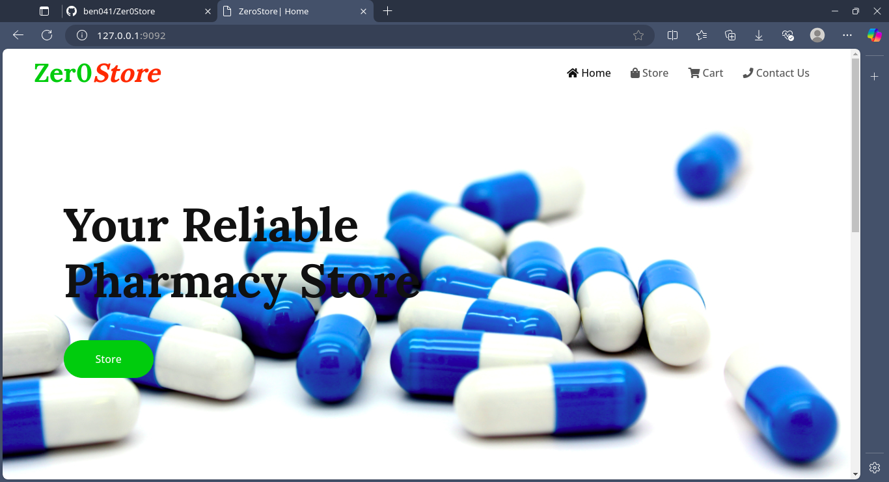
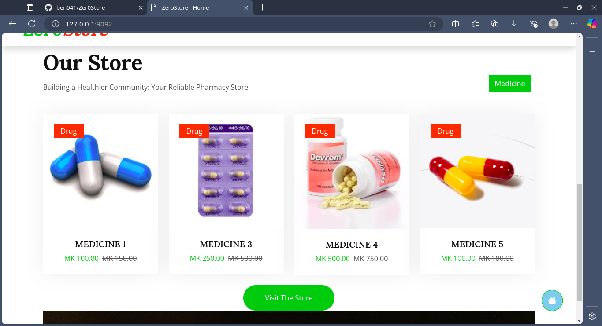

# Zer0Store

Zer0Store is an e-commerce web application built with Django, allowing users to browse products, view product details, and manage their shopping cart efficiently. The project aims to provide a seamless and user-friendly shopping experience.

## Features

- **Home Page**: Displays a list of available products with details like name, image, old price, and new price.
- **Product Page**: Detailed view of products including descriptions and prices.
- **Cart Page**: Allows users to manage their cart, view total prices, and proceed to payment.
- **Dynamic UI**: Responsive design with Bootstrap for a smooth user experience.
- **Persistent Cart**: Cart items are managed using localStorage for persistence across sessions.

## Project Structure

```plaintext
Zer0Store/
├── templates/
│   ├── index.html       # Home page template
│   ├── product.html     # Product details page template
│   ├── carts.html       # Cart page template
│   ├── base.html        # Base layout for templates
├── static/
│   ├── css/             # CSS files
│   ├── js/              # JavaScript files
│   ├── img/             # Images for the site
├── models.py            # Django models for the database
├── views.py             # Views for handling HTTP requests
├── urls.py              # URL routing
└── README.md            # Documentation
```

## Setup Instructions

1. **Clone the Repository**

   ```bash
   git clone https://github.com/ben041/Zer0Store.git
   cd Zer0Store
   ```

2. **Set Up Virtual Environment**

   ```bash
   python -m venv env
   source env/bin/activate  # On Windows: env\Scripts\activate
   ```

3. **Install Dependencies**

   ```bash
   pip install -r requirements.txt
   ```

4. **Apply Migrations**

   ```bash
   python manage.py makemigrations
   python manage.py migrate
   ```

5. **Run the Development Server**

   ```bash
   python manage.py runserver
   ```

6. **Access the Application**

   Open your browser and navigate to `http://127.0.0.1:8000`.

## Key Files and Code

### Models

```python
from django.db import models

class Products(models.Model):
    name = models.CharField(max_length=100)
    image = models.ImageField(upload_to='images')
    old_price = models.DecimalField(max_digits=10, decimal_places=2, default=0)
    new_price = models.DecimalField(max_digits=10, decimal_places=2, default=100)
    description = models.TextField(max_length=400)

    def __str__(self):
        return self.name
```

### Views

```python
from django.shortcuts import render
from .models import Products

def home(request):
    product = Products.objects.all()
    return render(request, 'index.html', {'product': product})

def cart(request):
    return render(request, 'carts.html')

def product(request):
    product = Products.objects.all()
    return render(request, 'product.html', {'product': product})
```

### URLs

```python
from django.urls import path
from django.conf import settings
from django.conf.urls.static import static
from . import views

urlpatterns = [
    path("", views.home, name="home-page"),
    path("cart", views.cart, name="cart-page"),
    path("product", views.product, name="product-page"),
] + static(settings.MEDIA_URL, document_root=settings.MEDIA_ROOT)
```

## Technology Stack

- **Backend**: Django
- **Frontend**: HTML, CSS, Bootstrap, JavaScript
- **Database**: SQLite (default, can be replaced)
- **Deployment**: Django development server

## Screenshots

### Home Page


### Store Page


## Contributing

Contributions are welcome! Please fork this repository and submit a pull request.

## License

This project is open-source and available under the MIT License.

## Contact

For inquiries or support, reach out to [Ben](mailto:benmalunga041@gmail.com).

---

Feel free to adjust the placeholders and add any additional details!